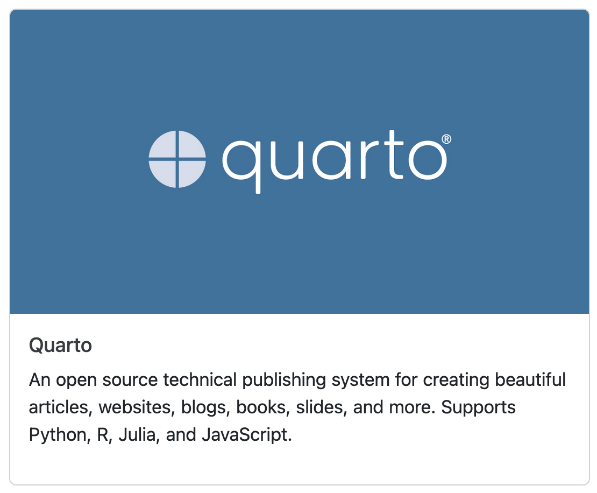

# QuartoCards Extension For Quarto

Generate cards for displaying URLs in your quarto presentations.
These are a bit like the preview cards you get when you post a link to Twitter, Discord, Reddit etc.

## Installing

```bash
quarto add WEHI-ResearchComputing/QuartoCards
```

This will install the extension under the `_extensions` subdirectory.
If you're using version control, you will want to check in this directory.

## Usage

At the simplest, just use the `url-card` shortcode, followed by a URL:

```
{{< url-card https://github.com/quarto-dev/quarto-cli }}
```

This will result in something like this appearing when you render your Quarto:

{max}

## Formats

QuartoCards are designed for the `html` output format.
Other formats like reveal and docx do work, but you likely won't get the border around the card.

## Options

The `url-card` shortcode has the following keyword arguments:
- `show_description=false`: disables the description part of the card. You might want to do this if the title already includes the description, like for GitHub links
- `show_title=false`: disables the title part
- `show_image=false`: disables the card image

For example:

```

```
